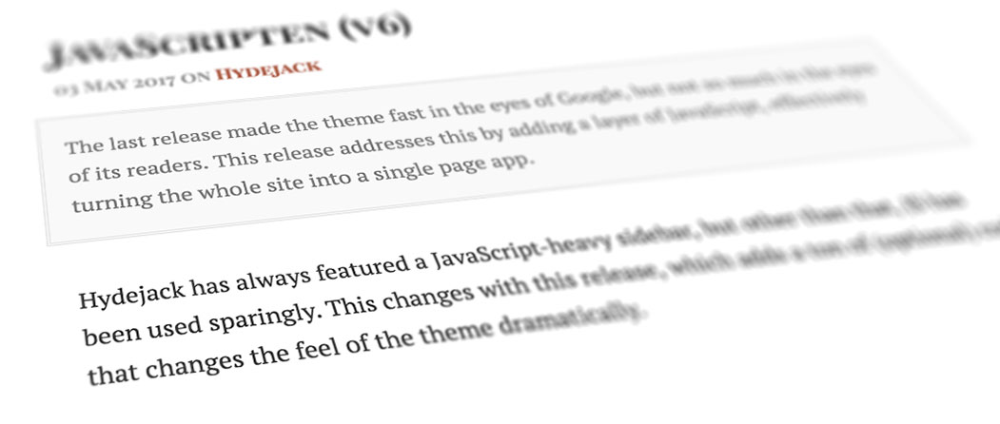

{:.lead}

***

## Attributions
* [IMac vector.svg](https://commons.wikimedia.org/wiki/File:IMac_vector.svg)
  by [Rafael Fernandez](https://commons.wikimedia.org/wiki/User:TheGoldenBox).
  License: [CC-BY-SA-3.0]. Changes: Apple logo removed, rasterized;
* [iPhone 6S Rose Gold.png](https://commons.wikimedia.org/wiki/File:IPhone_6S_Rose_Gold.png).
  License: [CC-BY-SA-3.0]. Changes: Desaturated;
* [iPad Air 2.png](https://commons.wikimedia.org/wiki/File:IPad_Air_2.png)
  by [Justinhu12](https://commons.wikimedia.org/wiki/User:Justinhu12).
  License: [CC-BY-SA-4.0]. Changes: Desaturated;

Screenshots can be reused under [CC-BY-SA-4.0].

[CC-BY-SA-4.0]: https://creativecommons.org/licenses/by-sa/4.0/
[CC-BY-SA-3.0]: https://creativecommons.org/licenses/by-sa/3.0/
